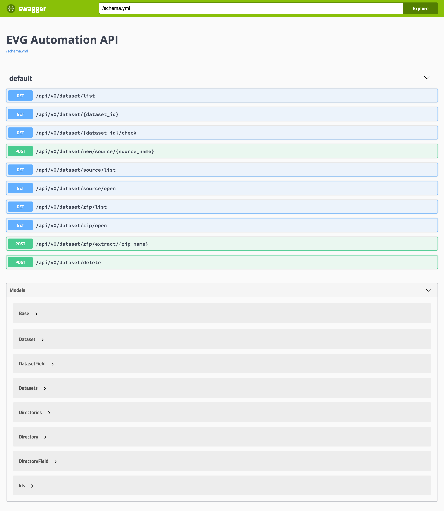

## Install pyenv

Please see [here](https://github.com/pyenv/pyenv#installation).

## Install python

```
pyenv install 3.8.3
pyenv global 3.8.3
```

## Install pipenv

```
pip install --user pipenv
```

Add `$HOME/.local/bin` to PATH.

## Setup python and dependencies

```
pipenv install
```

## Check API Document

Run

```
pipenv run dev
```

and Open http://localhost:8000/apidocs ,

then you can see the API Document like below


